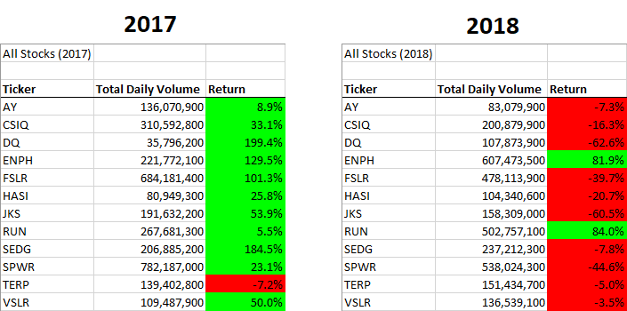
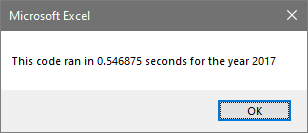
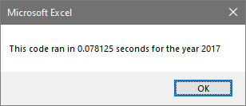
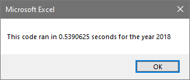
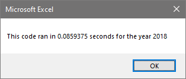

# An Analysis of Green Stocks

## Overview of the Project

The purpose of this analysis was to compare Green Energy stocks from the years 2017 and 2018 – to see whether it was a good idea to invest in the market. We are helping a client compare the two years based on the daily volume and the yearly return. We are looking for evidence of the Green Energy market growing, as it becomes a more dominant power in the field. Our first focus is on the DACO corporation (ticker DQ) as a starting point, and then to apply the same analysis to the rest of the stocks.

## Results

### A Comparison of Years (2017 vs. 2018)

Our comparison will be based on the individual stocks yearly returns, and we are going to compare the years 2017 and 2018. To make the comparison easier to see visually we added a section in VBA to format the code based on whether the return was positive (green) or negative (red). This allowed us to quickly see the difference in the years and see that almost all the stocks performed better in 2017 rather than 2018.



Even a cursory glance as these two years informs the reader that 2018 had a much worse return for most of the stocks when compared to 2017. So, our expectation that the Green Energy field would grow year over year is flawed. There was about the same total volume of trades made each year too, so no noticeable increase in either of our compared factors.

### Execution Time (Original vs. Refactored)

Once we had the original program together and working it was time to refactor the code –our program worked on this many rows of data (3012), but we also want it to be scalable and work on tens of thousands of rows. This way we will have the option to compare any number of stocks, without a long period of waiting for the results. In the original version we were cycling through the whole dataset for every ticker we had input – most of this was just our program confirming a value did not match a value, which was a large waste of runtime. Refactoring the code meant reorganising the program so we would only be cycling through the dataset the once, rather than once for every ticker. The issue lay in this part of the original code, in the nested for loop:

```vba
For j = 0 To 11
        Worksheets(yearValue).Activate
        ticker = tickers(j)
        totalVolume = 0
        ‘Loop through entire dataset.
        For i = 2 To rowEnd
        'increase totalVolume if ticker matches
        'Assigns values to staring/ending variables
            If Cells(i, 1) = ticker Then
		…
```

So, instead of running through the whole dataset each time, we would run through it once and pull out the parts we needed and connect them to various arrays and variables to keep track that way. This meant we removed the nested for loop and sped the program up dramatically, you can see the comparisons of the original program vs. the refactored one below:

<center>

BEFORE                    |  AFTER
:-------------------------:|:-------------------------:
  |  
  |  

</center>

As you can clearly see there was a dramatic improvement in the runtime of the program from the original (BEFORE) and the refactored code (AFTER). This quite simply proves that the refactoring was worth the work.

## Summary

We saw that there was a marketed decrease in the returns of most of the Green Stocks, seeing this would make me wary of investing in an industry having such a decline in the space of one year. A limitation of this dataset is the comparison of just Green Energy stocks though, we would have to investigate whether this was a market wide decrease or an Energy sector decrease, or it could just be a Green Energy issue. We may also be well served by looking into the changes over the months, perhaps month-to-month saw positive results, but something changed throughout the year. Of course, we would keep in mind our refactored code and use that when looking at these other comparisons.

### The Advantages and Disadvantages of Refactoring Code

- Refactoring makes the system faster – if this is a program that is used a lot the time savings will outweigh the time invested into making the program run better.
- Refactoring generally makes a program easier to understand – any effort put into the refactorization of the code will only be worth it if the code is more understandable and even more adaptable. In general, as programmer, you want to keep improving your software design.
- The only real downside I could envision is when a program design is pressed for design, refactoring is something that comes later to speed up and improve an already working program.
- Any refactoring should be done away from a final product, and tested thoroughly, there is little gain from refactoring a program when it hampers the original or causes more problems down the line.

### How These Apply to Our Stock Analysis

Our program was much faster than the original, immediately telling me that the work was worth it. The time invested to improve the program was minimal compared to the gains from having it run so much faster. I also believe the program has kept the same readability if not improved upon it, including having extra comments and a more sensible structure. A definable design pattern can be seen in the code, and we have labored over not repeating ourselves or running unnecessary tasks throughout it.

As we had a working program, we were able to spend time to refactor it, which did not affect the workings of the original program. Since this was the main point of the challenge and analysis, we did not need to worry about the workability of the program being against a time crunch. Overall, I would say the analysis and refactoring was a success.
